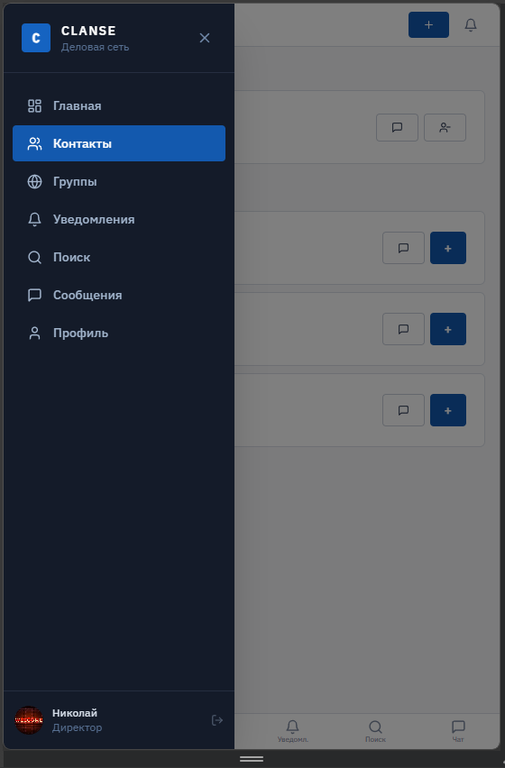
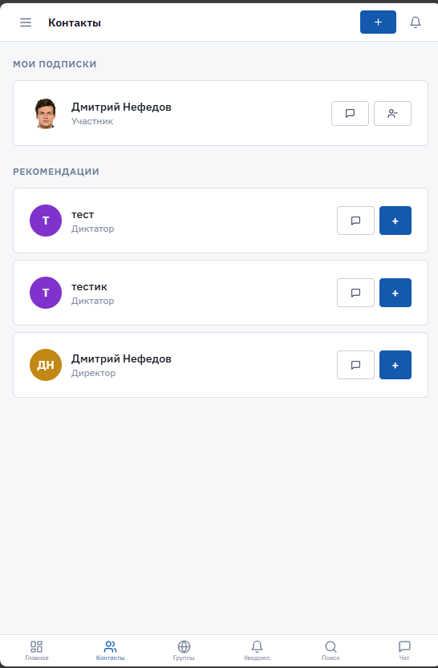
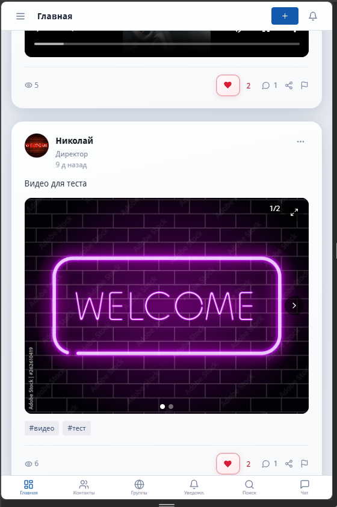
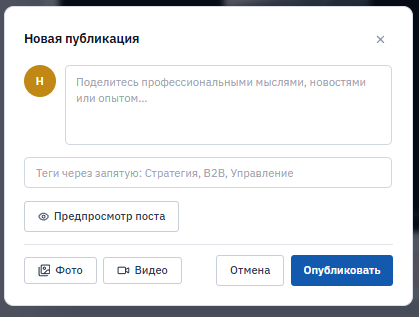
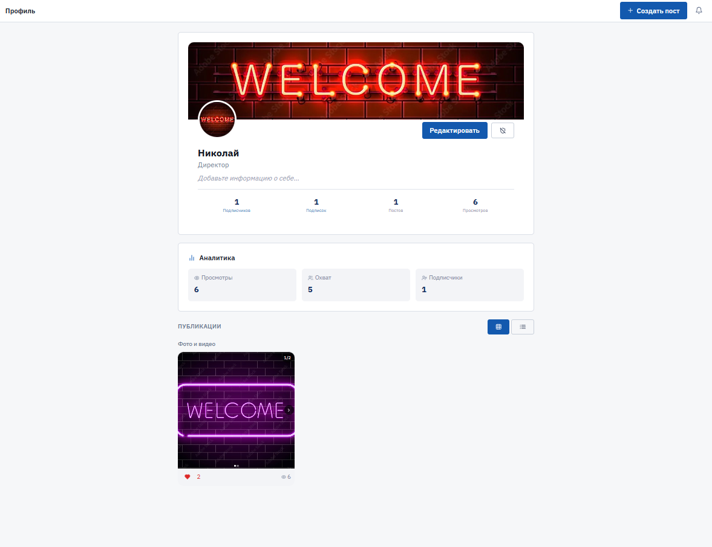
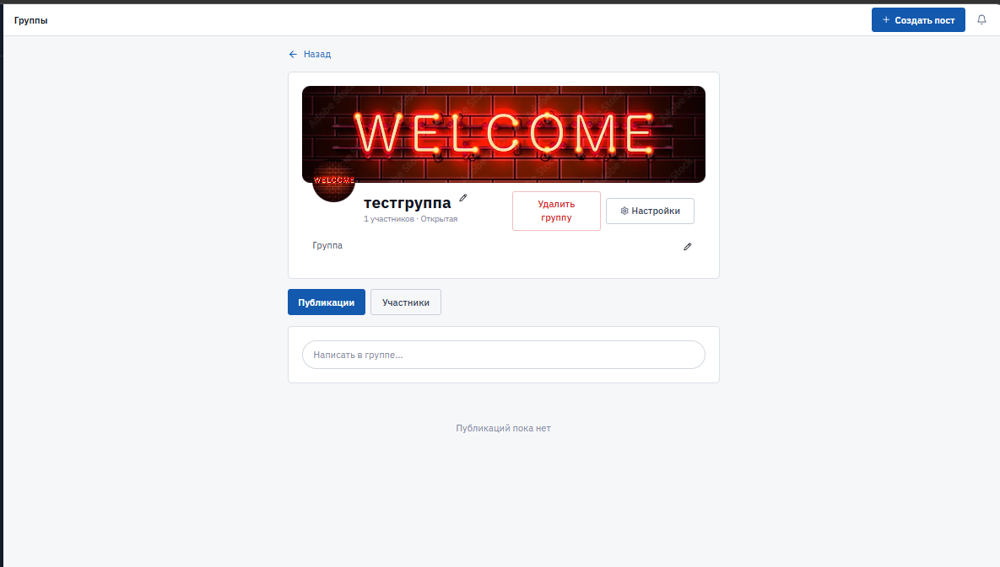
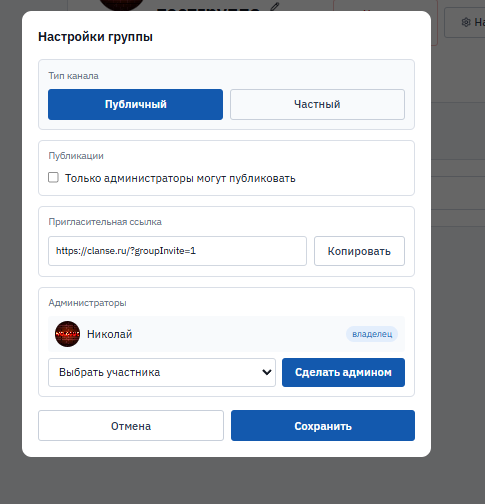

# Clanse: доработка и сопровождение веб‑соцсети

> [!IMPORTANT]
> **Публикация:** описание проекта и скриншоты для портфолио. **Исходный код в репозиторий не выкладывается** (коммерческий заказ). Данные заказчика и пользователей не раскрываются.

> [!NOTE]
> **Не разработка с нуля.** Работа велась по **уже существующей** соцсети заказчика: доработка функций, исправления, перенос на прод, почта, миграции БД и сопровождение после запуска.

## 💡 Кратко

**Clanse** ([clanse.ru](https://clanse.ru)) — веб‑соцсеть (лента, чаты, группы, админка). В рамках заказа я **не создавал продукт с нуля**, а **развивал и доводил до продакшена** существующую кодовую базу: перенос на **VPS**, настройка **SMTP/DNS**, новые и доработанные сценарии (email, уведомления, мобильный чат/медиа), **SQL‑миграции**, деплой‑скрипты и итеративные правки по обратной связи заказчика.

## ✅ Что доработал и внедрил (моя работа)

### Продакшен и инфраструктура
- Перенос и обслуживание на **VPS** (nginx, systemd `clanse-api`, `/etc/clanse/env`).
- Скрипты деплоя с Windows: только фронт, фронт+бэк, отдельная синхронизация `auth` / `posts` / `social` + миграции.
- Домен **clanse.ru**, HTTPS, раздача статики и прокси `/api/*` на Python‑шлюз.

### Почта и авторизация
- Настройка исходящей почты: **SMTP**, `smtp.clanse.ru`, PTR на хостере, правки DNS (Reg.ru).
- Доработка сценариев: **подтверждение email** при регистрации, **сброс пароля** (HTML‑письма, корректные ссылки с фронта).
- Исправление багов восстановления пароля и пустого экрана по ссылке из письма.

### Уведомления и активность
- Email при **подписке** и **новом сообщении**, если пользователь **офлайн** (`last_active_at`, порог в минутах).
- Пинг **`activity_ping`** с фронта, чтобы статус «в сети» и гейт писем работали предсказуемо.

### UX и мобильная вёрстка
- Чат на телефонах: поле ввода не уезжает под нижнее меню, фикс на проблемных iOS/Android.
- Просмотр медиа: закрытие на мобильных, свайп галереи, доработки ленты и модалок.

### Бэкенд и БД
- Новые и обновлённые **SQL‑миграции** (в т.ч. верификация email, `last_active_at`, группы, админ‑жалобы).
- Правки модулей **`auth` / `posts` / `social`** и единого шлюза **`deploy/gateway.py`**.

### Админка и сопровождение
- Доработки раздела **Админ** (пользователи, группы, жалобы) по запросам заказчика.
- Итеративные релизы по обратной связи после выкладки на прод.

## 🔌 API и интеграции

- REST‑эндпоинты `/api/auth`, `/api/posts`, `/api/social` (JSON, CORS).
- **S3‑совместимое хранилище** (boto3) для медиа и аватаров.
- **SMTP** (465/587) для исходящей почты с VPS.

## 🧰 Технологии

| Категория | Стек |
|-----------|------|
| Frontend | React 18, TypeScript, Vite, Tailwind CSS, shadcn/ui (Radix) |
| Backend | Python 3, Starlette, uvicorn, psycopg2 |
| БД | PostgreSQL, SQL‑миграции |
| Медиа | S3‑compatible storage (boto3) |
| Инфраструктура | Ubuntu VPS, nginx, systemd, bash/PowerShell deploy |
| Почта | SMTP, DNS (A/PTR), HTML‑письма |

## 🌐 Сайт

Продакшен: **[clanse.ru](https://clanse.ru/)** — деловая сеть CLANSE (регистрация на стороне заказчика).

## 🖼️ Скриншоты интерфейса

| # | Экран |
|---|--------|
| 1 | Боковое меню, навигация (мобильный вид) |
| 2 | Контакты: подписки и рекомендации |
| 3 | Главная: лента, пост с фото/видео, лайки и комментарии |
| 4 | Создание публикации (текст, теги, фото/видео) |
| 5 | Профиль: обложка, аналитика, публикации |
| 6 | Страница группы: участники, лента, настройки |
| 7 | Настройки группы: тип, права публикации, админы, invite‑ссылка |

Файлы — в [`docs/`](docs/).

## 🤝 Роль и формат работы

Коммерческий заказ на **фрилансе**: **доработка и сопровождение** готовой соцсети, а не greenfield‑разработка. Фокус — вывести на **прод**, починить критичные сценарии, добавить согласованные фичи (почта, уведомления, админка), держать релизный цикл (фронт/бэк/миграции) и правки по фидбеку заказчика.

## Исходный код

> [!NOTE]
> В публичный доступ не передаётся. По запросу для работодателя возможен **ограниченный разбор архитектуры** (модули API, схема БД, деплой) без нарушения интересов заказчика.

## Лицензия

> [!CAUTION]
> Описание и скриншоты — для портфолио. Права на продукт у заказчика; копирование и использование кода из этого репозитория **не предполагаются** (кода здесь нет).
